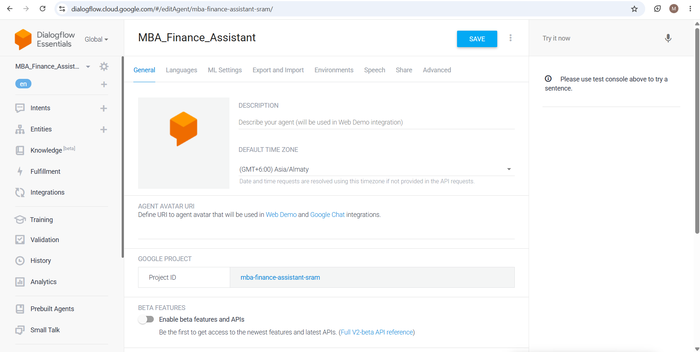
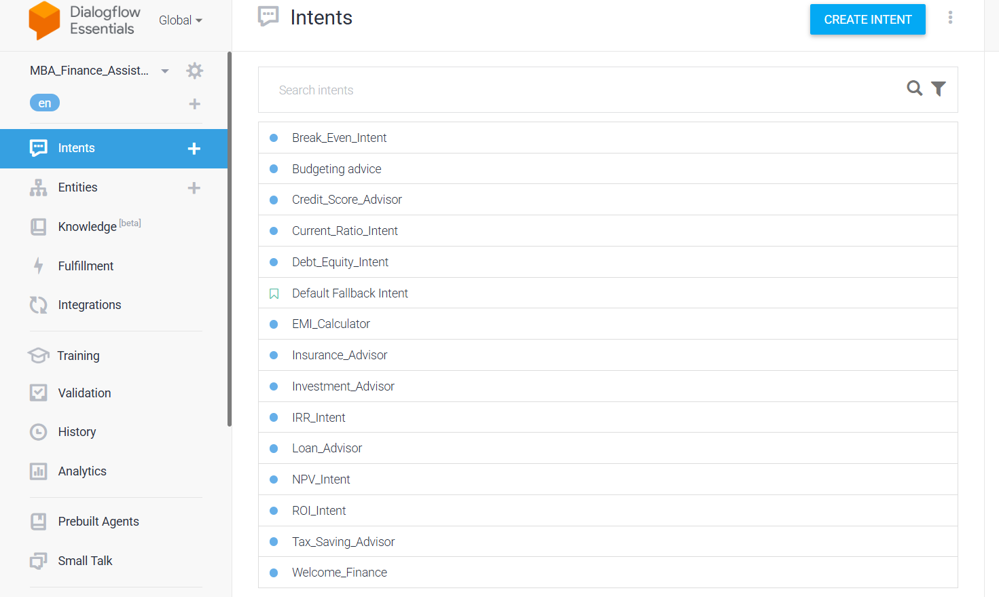
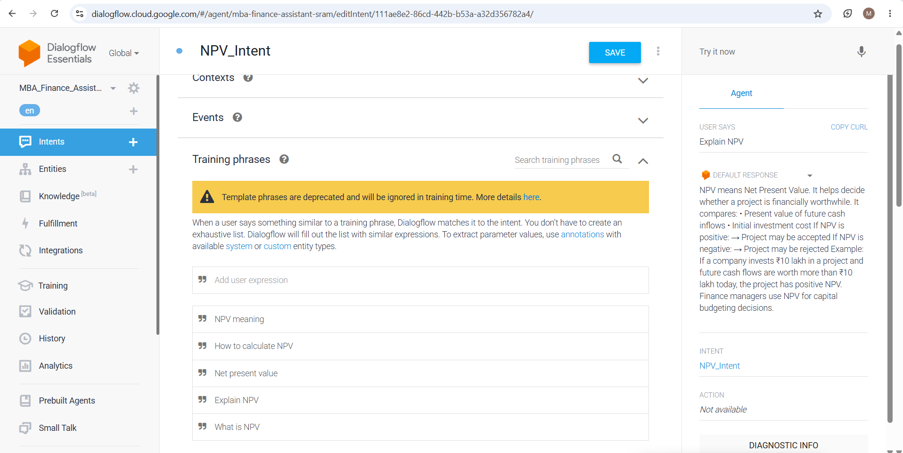
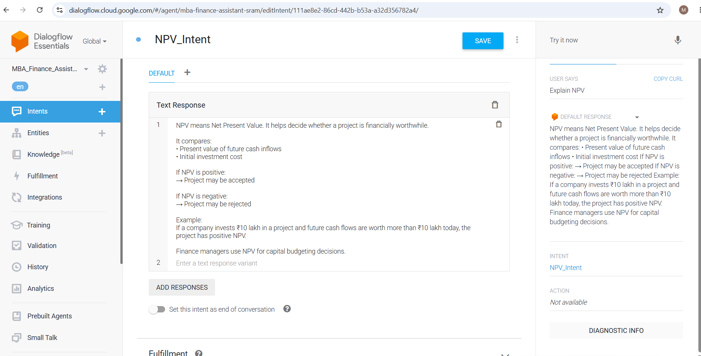
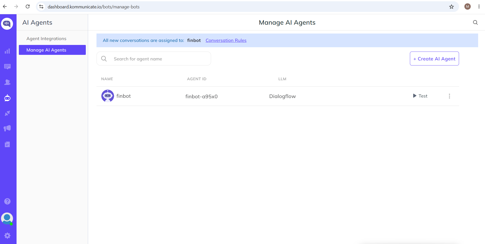
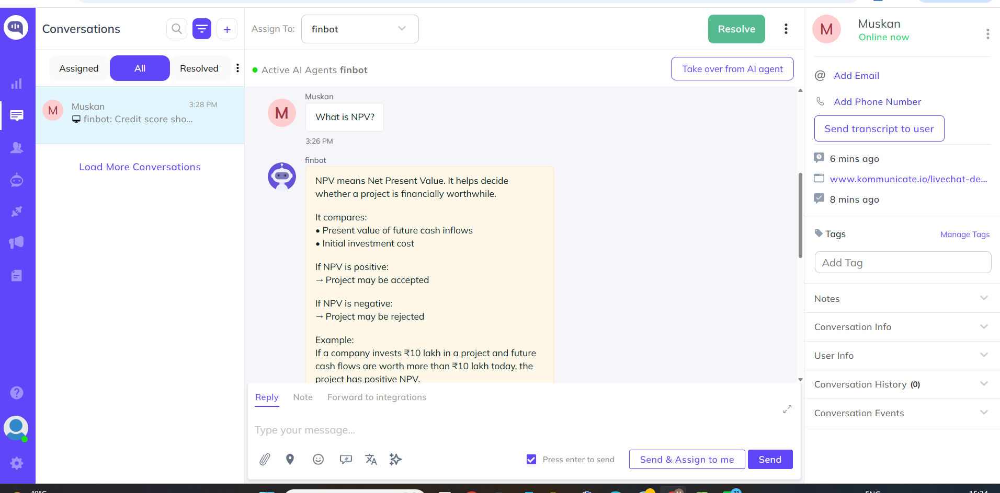
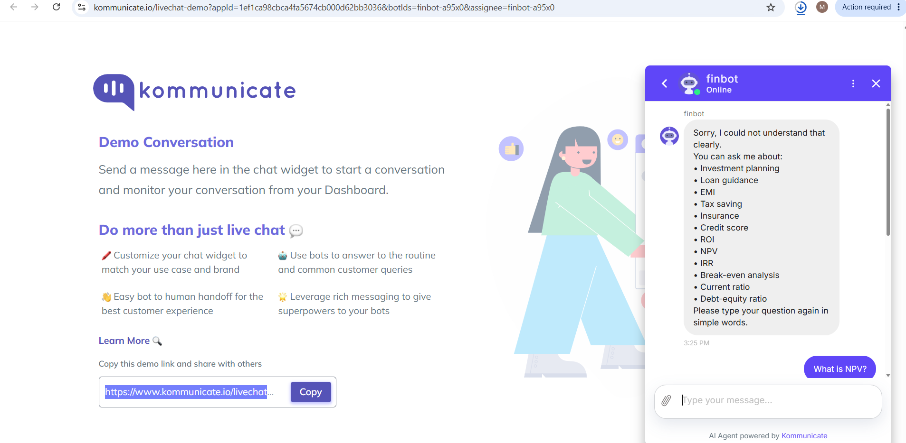

# FinBot – AI Banking Chatbot using Dialogflow & Kommunicate

## Overview

FinBot is an AI-powered banking and finance chatbot built using Dialogflow and integrated with Kommunicate for live chat support and customer interaction.

The chatbot provides instant responses to finance-related queries such as:

* Credit Score Information
* NPV (Net Present Value)
* Loan Guidance
* Banking FAQs
* Financial Concepts

The project demonstrates how conversational AI can automate customer support in the banking and finance domain.

---

## Features

* AI-powered finance chatbot
* Natural Language Processing using Dialogflow
* Kommunicate live chat integration
* Automated replies for finance queries
* User-friendly conversational interface
* Real-time chatbot responses
* Banking and loan assistance support

---

## Technologies Used

* Dialogflow ES / CX
* Kommunicate
* JavaScript
* HTML/CSS
* NLP (Natural Language Processing)

---

## Sample User Queries

Users can ask questions like:

* “What is NPV?”
* “Loan credit score should be?”
* “How to improve credit score?”
* “What is EMI?”
* “Explain banking terms”

---

## Chatbot Responses

### Credit Score Response

The chatbot explains:

* What a credit score means
* Credit score ranges
* Tips to improve credit score
* Importance in loan approval

### NPV Response

The chatbot explains:

* Meaning of Net Present Value
* Positive vs Negative NPV
* Investment examples
* Financial decision-making concepts

---

## Dialogflow Intents Included

* Credit Score Intent
* NPV Intent
* Loan Information Intent
* Finance FAQ Intent
* Greeting Intent
* Fallback Intent

---

## Kommunicate Integration

The chatbot is integrated with Kommunicate to provide:

* Live chat interface
* AI agent support
* Human handoff support
* Conversation management dashboard

---

## Project Workflow

1. User sends a finance-related query
2. Kommunicate receives the message
3. Dialogflow processes user intent
4. Chatbot generates intelligent response
5. Response is displayed in live chat

---

## Screenshots

### Agent Creation

### Intent List

### NPV Intent Configuration

### Chatbot Response Testing

### Service Account Creation

### JSON Key Generation

### Kommunicate Setup

### Kommunicate Dashboard

### FinBot Chat Interface

---

## Future Enhancements

* Loan eligibility calculator
* EMI calculator integration
* Account balance support
* Voice-enabled chatbot
* Multilingual support
* Banking API integration

---

## Use Cases

* Banking customer support
* Financial education assistant
* Loan guidance system
* Automated FAQ handling
* AI-powered finance assistant

---

## Author

Developed using Dialogflow and Kommunicate for conversational AI in finance and banking support systems.
